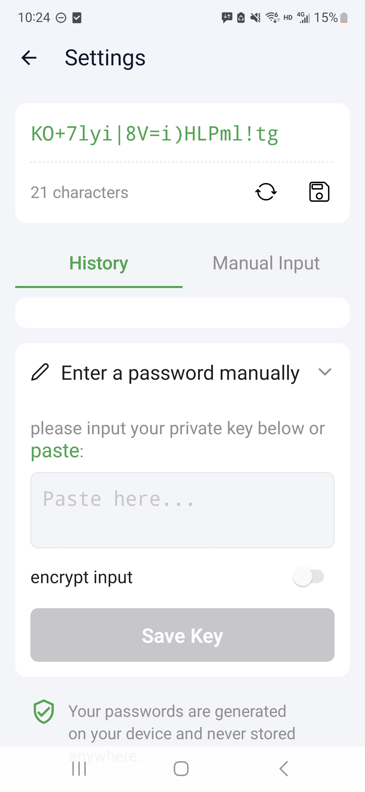

OK, what we're trying to do here: we want to encrypt our own messages before sending to people.

* **Crypto:** Using Rust for the crypto algorithm (AES).
* **Bridge:** Using UniFFI to bridge Rust code to Kotlin (for Android); no iOS for now.
* **Frontend:** We are using React Native Expo and SQLite.

## 📱 Screenshots
<table>
  <tr>
    <td align="center"> <b>Home</b></td>
    <td align="center"> <b>Settings</b></td>
  </tr>
</table>

## Todo
- [ ] Encrypt audio
- [ ] Rename some file names
